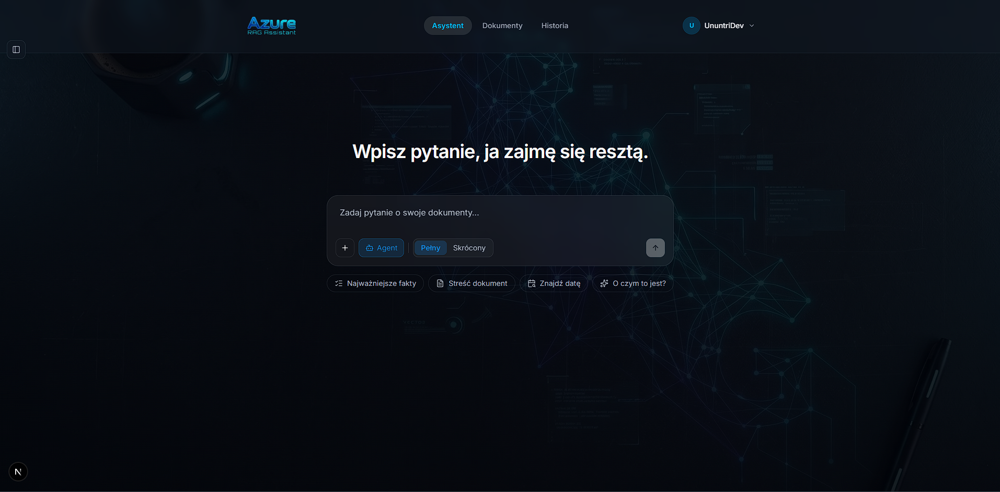
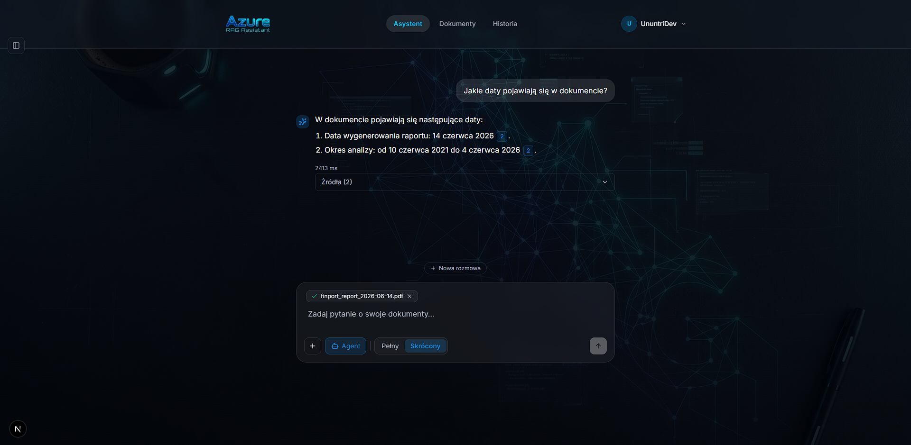
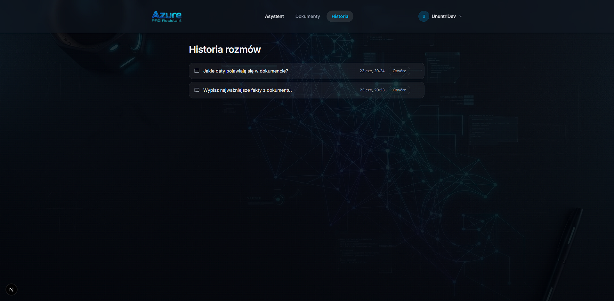
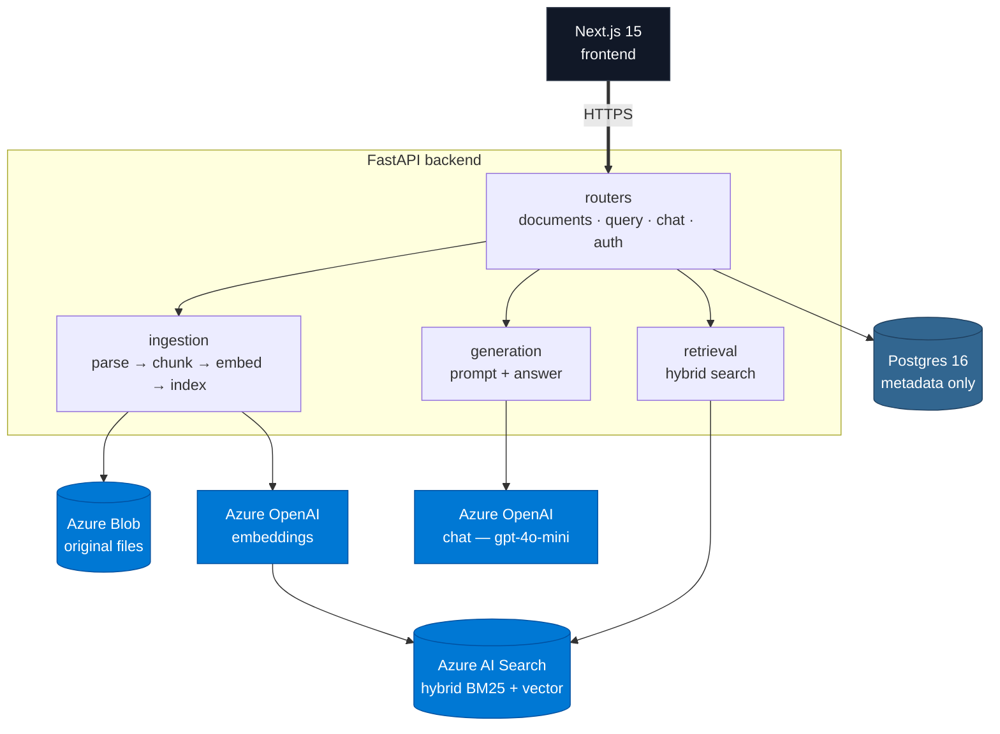

# Azure RAG Knowledge Assistant

Upload documents (PDF, Word, Excel, CSV), ask questions, get answers grounded in your files
**with citations** (`[file.pdf, p. 7]`, `[data.xlsx, sheet Sales, rows 10–60]`, `[note.docx, section: Intro]`).
Portfolio project — all four stages implemented, plus production hardening (Google auth,
rate limiting, Redis caching, OpenTelemetry traces). See **Status** at the bottom.

**Stack:** FastAPI + Postgres 16 (metadata) · Azure AI Search (hybrid BM25+vector) · Azure OpenAI
(configurable chat deployment — `gpt-4o-mini` recommended for cost — + `text-embedding-3-small`
embeddings) · Azure Blob · Next.js 15 + shadcn/ui.

## Preview







## Architecture



- **Postgres** stores metadata only (`documents`, `query_logs`, `conversations`, `messages`,
  `traces`). Vectors live in Azure AI Search.
- Ingestion runs on a **Redis queue** consumed by a worker process (`python -m app.worker`);
  if Redis is unavailable it falls back to a FastAPI **BackgroundTask**. The document row
  drives state: `pending → processing → indexed | failed`.
- Delete removes a document from **all three** stores (Postgres row, Blob original, AI Search chunks).

## Getting started

### Step 1 — Install prerequisites

| Tool | Purpose | Install |
|------|---------|---------|
| [Docker Desktop](https://www.docker.com/products/docker-desktop/) | runs the full stack | docker.com |
| [Git](https://git-scm.com/) | clone the repo | git-scm.com |
| Azure account | OpenAI · AI Search · Blob | [portal.azure.com](https://portal.azure.com) |

### Step 2 — Provision Azure services

Follow [`docs/azure-setup.md`](docs/azure-setup.md) to create:

1. **Azure OpenAI** — deploy `gpt-4o-mini` (chat) and `text-embedding-3-small` (embeddings)
2. **Azure AI Search** — Basic SKU, note the endpoint and API key
3. **Azure Blob Storage** — create a container called `documents`

You will get a set of keys and endpoints — you need them in the next step.

### Step 3 — Clone and configure

```bash
git clone https://github.com/UnuntriDev/Azure-RAG.git
cd Azure-RAG
cp .env.example .env
```

Open `.env` and fill in the values from Step 2:

```env
AZURE_OPENAI_ENDPOINT=https://<your-resource>.openai.azure.com/
AZURE_OPENAI_API_KEY=...
AZURE_OPENAI_CHAT_DEPLOYMENT=gpt-4o-mini
AZURE_OPENAI_EMBEDDING_DEPLOYMENT=text-embedding-3-small
AZURE_SEARCH_ENDPOINT=https://<your-resource>.search.windows.net
AZURE_SEARCH_API_KEY=...
AZURE_STORAGE_CONNECTION_STRING=DefaultEndpointsProtocol=https;...
```

Everything else in `.env` has working defaults for local development.

### Step 4 — Run

```bash
docker compose up --build
```

- Frontend → http://localhost:3000
- Backend health check → http://localhost:8000/api/health

Migrations run automatically on first start. Upload a document, ask a question — done.

> **Port conflict?** `BACKEND_PORT=8002 docker compose up --build` then set
> `NEXT_PUBLIC_API_URL=http://localhost:8002` in `frontend/.env.local`.

### Frontend hot-reload (optional)

If you want live reload while editing the UI, run the frontend outside Docker:

```bash
cd frontend && npm install && npm run dev   # http://localhost:3000
```

## API

List endpoints (`/api/documents`, `/api/query/logs`, `/api/chat`, `/api/traces`) are
cursor-paginated: `{items: [...], next_cursor}` (pass `?cursor=` for the next page).

| Method | Path | |
|--------|------|--|
| POST   | `/api/documents/upload`      | upload PDF/Word/Excel/CSV (multipart) → `{id, filename, status}` |
| GET    | `/api/documents`             | list documents (paginated) |
| GET    | `/api/documents/{id}`        | one document |
| DELETE | `/api/documents/{id}`        | remove from Postgres + Blob + AI Search |
| POST   | `/api/documents/{id}/analyze`| summary, key points, entities, suggested questions |
| POST   | `/api/query`                 | `{question}` → `{answer, sources, latency_ms}` (classic RAG) |
| GET    | `/api/query/logs`            | recent queries (paginated) |
| POST   | `/api/chat`                  | streaming chat (SSE): `conversation`/`tool`/`delta`/`sources`/`done`/`error` |
| GET    | `/api/chat`                  | list conversations (paginated) |
| GET    | `/api/chat/{id}`             | conversation with messages |
| DELETE | `/api/chat/{id}`             | delete a conversation |
| GET    | `/api/prompts`               | available prompt versions (answer styles) |
| GET    | `/api/traces`                | agent/RAG traces (paginated) · `/{id}` for one |
| POST   | `/api/auth/login`            | exchange Google ID token → HttpOnly session cookie |
| POST   | `/api/auth/logout`           | clear the session cookie |
| GET    | `/api/auth/me`               | current user (from cookie) |
| GET    | `/api/health` · `/api/ready` | liveness · readiness |

When `GOOGLE_CLIENT_ID` is set, every `/api/*` route (except auth + health) requires a valid
session — sent as an HttpOnly cookie (browser) or `Authorization: Bearer <id_token>` (curl/Postman).

## Environment variables

See `.env.example` — every variable is documented inline. Summary:

| Group        | Keys |
|--------------|------|
| Postgres     | `POSTGRES_USER`, `POSTGRES_PASSWORD`, `POSTGRES_DB`, `DATABASE_URL`, `DB_SSL_REQUIRE` |
| Azure OpenAI | `AZURE_OPENAI_ENDPOINT`, `AZURE_OPENAI_API_KEY`, `AZURE_OPENAI_API_VERSION`, `AZURE_OPENAI_CHAT_DEPLOYMENT`, `AZURE_OPENAI_EMBEDDING_DEPLOYMENT` |
| AI Search    | `AZURE_SEARCH_ENDPOINT`, `AZURE_SEARCH_API_KEY`, `AZURE_SEARCH_INDEX_NAME`, `AZURE_SEARCH_SEMANTIC_CONFIG` (optional) |
| Blob         | `AZURE_STORAGE_CONNECTION_STRING`, `AZURE_STORAGE_ACCOUNT_URL`, `AZURE_STORAGE_CONTAINER` |
| Auth (Google)| `GOOGLE_CLIENT_ID` — empty disables auth (all endpoints public) |
| Session cookie| `COOKIE_SECURE`, `COOKIE_SAMESITE`, `COOKIE_DOMAIN` — for cross-site prod use `none` + `true` |
| Redis        | `REDIS_URL` — empty disables caching + the queue (worker falls back to BackgroundTask) |
| Telemetry    | `APPLICATIONINSIGHTS_CONNECTION_STRING` (optional) |
| App          | `CORS_ORIGINS` (exact origins, no `*`), `LOG_LEVEL`, `MAX_UPLOAD_MB`, `HTTPS_REDIRECT` |
| Frontend     | `NEXT_PUBLIC_API_URL`, `NEXT_PUBLIC_GOOGLE_CLIENT_ID`, `NEXT_PUBLIC_SHOW_TRACES` |

> `.env` is gitignored. Never commit real keys; rotate them if they ever leak.

### Authentication

Optional, off by default. Set `GOOGLE_CLIENT_ID` (backend) + `NEXT_PUBLIC_GOOGLE_CLIENT_ID`
(frontend, same value) to require Google sign-in. The session is a verified Google ID token
stored in an **HttpOnly cookie** (`SameSite`/`Secure` configurable) — JS never reads it, which
blocks token theft via XSS. Because auth uses cookies, `CORS_ORIGINS` must list exact frontend
origins (`*` is rejected by browsers with credentials), and a cross-domain frontend/API needs
`COOKIE_SAMESITE=none` + `COOKIE_SECURE=true`.

## Adding your first document

Supported formats: **PDF, Word (.docx), Excel (.xlsx), CSV**. Legacy binary `.doc`/`.xls` are
rejected with a clear message (save as `.docx`/`.xlsx`).

1. Open http://localhost:3000
2. Upload a file — the row appears with status `pending`; polling flips it `processing → indexed`.
3. Ask a question — the answer cites sources by a format-specific location: PDF `[file.pdf, p. X]`,
   Excel `[data.xlsx, sheet Sales, rows 10–60]`, CSV `[data.csv, rows 10–60]`, Word
   `[note.docx, section: Intro]` — each expandable with its scored fragment.
   Questions outside the documents return *"I couldn't find this information in the documents."*
   (The shipped UI is Polish: *"Nie znalazłem tej informacji w dokumentach."*)

## Project structure

```
azure-rag/
├── backend/            # FastAPI: routers, services (ingestion/retrieval/generation/agent/storage),
│                       #   auth, worker (Redis queue), db, alembic, tests
├── frontend/           # Next.js 15 App Router: app/, components/, lib/api.ts, types/api.ts
├── infra/              # Bicep IaC (Container App, Postgres, Static Web App, Key Vault) — see infra/README.md
├── .github/workflows/  # CI: backend (ruff + pytest) and frontend (lint + build)
├── docs/azure-setup.md # az CLI steps to provision the Azure resources
└── docker-compose.yml  # Postgres + Redis + backend + worker + frontend
```

## Code quality

- Backend (`backend/`): `uv run ruff check .` + `uv run black .`
- Frontend (`frontend/`): `npm run lint`

**Pre-commit hooks** run all of the above automatically on `git commit`:

```bash
uv run --directory backend pre-commit install      # once, after cloning
uv run --directory backend pre-commit run --all-files   # run on the whole repo
```

## Status

All four stages implemented:

- **Stage 1 — RAG** — upload → ingest → hybrid retrieval → answer with citations, end-to-end.
- **Stage 2 — Streaming chat** — SSE token streaming, conversations, file-scoped context.
- **Stage 3 — Agent** — LangGraph ReAct agent with `search_documents`, `compare_documents`, `calculator` tools.
- **Stage 4 — Deployment artifacts** — Bicep IaC (`infra/`) + GitHub Actions CI/CD. Deploy-ready,
  **not yet provisioned** — see `infra/README.md`.

**Production hardening** (on top of the four stages): Google auth with HttpOnly-cookie sessions,
per-IP rate limiting, Redis caching + ingestion queue, OpenTelemetry traces → Application Insights,
security headers, cursor pagination, and a backend test suite (`uv run --directory backend pytest`).
